# adversarial-iot-ids

**Can a deep learning model detect cyberattacks in Industrial IoT networks; and what happens when an attacker deliberately tries to fool it?**

This project builds and stress-tests an intrusion detection system for IIoT environments. It does not stop at accuracy numbers on clean data. It attacks the model using adversarial perturbations, measures how badly performance degrades, and then builds a secondary defence layer that tries to catch attacks the classifier itself missed  using the model's own explanations against the attacker.

---

## Why this problem matters

Industrial IoT networks: factory floor sensors, smart grid controllers, SCADA systems, MQTT-connected industrial devices, are high-value targets. Traditional signature-based intrusion detection fails against novel attack patterns. Deep learning offers better generalisation, but introduces a new vulnerability: adversarial examples. A small, carefully crafted perturbation to network traffic features can silently flip a deep learning classifier from "attack" to "normal" without any change a human analyst would notice. This project investigates that vulnerability directly and proposes a detection mechanism for it.

---

## Dataset

**Edge-IIoTset**: a realistic IIoT cybersecurity benchmark generated from a physical testbed of 10+ heterogeneous device types including temperature sensors, heart rate monitors, and Modbus-compatible industrial controllers.

- 2.2 million network traffic samples
- 15 classes: normal traffic + 14 attack categories
- Attack types: DDoS (UDP, ICMP, TCP, HTTP), SQL injection, XSS, port scanning, OS fingerprinting, MITM, ransomware, backdoor, password attacks
- Severely imbalanced — normal traffic is 73% of all samples

A 15% stratified subsample (286,450 samples) was used for computational feasibility on Kaggle GPU.

Full dataset: https://www.kaggle.com/datasets/mohamedamineferrag/edgeiiotset-cyber-security-dataset-of-iot-iiot

---

## Models

Four models were trained and evaluated against each other:

| Model | Description |
|---|---|
| Random Forest | Classical ML baseline — 100 estimators, max depth 20 |
| CNN | Three Conv1D layers — spatial pattern detection only |
| BiLSTM | Two bidirectional LSTM layers — sequential context only |
| **Hybrid (proposed)** | Parallel CNN + BiLSTM merged into a Transformer encoder |

The hybrid model runs CNN and BiLSTM simultaneously on the same input, concatenates their outputs, and feeds them into a Transformer encoder block. The Transformer's multi-head self-attention calculates pairwise relationships across all features at once, something neither CNN nor BiLSTM can do alone. This parallel-path design is the core architectural contribution of this study.

---

## Key decisions explained

**Why Borderline-SMOTE — and why only on training data?**

The dataset is severely imbalanced. Standard SMOTE generates synthetic minority-class samples randomly. Borderline-SMOTE targets the decision boundary specifically, generating synthetic samples where the classifier is most likely to fail. More importantly, SMOTE was applied exclusively to the training set, after the three-way stratified split. Applying it before splitting would allow synthetic versions of test-set samples to appear in training, meaning the model validates against artificial patterns rather than real traffic. This is a data leakage issue that inflates reported performance and invalidates the evaluation.

**Why did Random Forest beat the hybrid on clean data?**

Random Forest: 97.79% accuracy. Hybrid: 93.54%. This is not a failure, it is an expected and documented finding. Edge-IIoTset is a feature-engineered tabular dataset. Tree-based models are consistently superior on tabular data because they are robust to uninformative features and can learn arbitrary decision boundaries without the regularisation constraints neural networks require. 

**What is SHAP attribution fingerprinting?**

SHAP (SHapley Additive exPlanations) values describe which input features drove a model's prediction. Under adversarial attack, these attribution patterns shift in detectable ways, even when the classifier itself is fooled. A shallow autoencoder (architecture: 47→64→16→64→47) was trained on SHAP attribution vectors from clean samples. At inference, if a new sample's attribution vector produces reconstruction error above the 95th percentile of clean-data errors, it is flagged as a potential adversarial evasion attempt. The defence operates on how the model explains its decision, not on the raw input.

**Why not PGD?**

Projected Gradient Descent is a stronger iterative adversarial attack that would give a more rigorous robustness evaluation. It was excluded due to compute constraints on Kaggle GPU. This is an acknowledged limitation.

---

## Results

### Clean data performance

| Model | Accuracy | F1 (Macro) | MCC |
|---|---|---|---|
| Random Forest | 97.79% | 89.76% | 0.954 |
| CNN | 93.52% | 73.83% | 0.866 |
| BiLSTM | 93.54% | 73.36% | 0.864 |
| **Hybrid** | **93.54%** | **73.78%** | **0.867** |

### Hybrid model under FGSM adversarial attack

| Epsilon | Accuracy |
|---|---|
| 0.00 (clean) | 93.54% |
| 0.01 | ~91% |
| 0.05 | ~85% |
| 0.10 | ~80% |
| 0.20 | 74.70% |

### SHAP attribution fingerprinting defence

| Epsilon | Detection Rate | False Positive Rate |
|---|---|---|
| 0.10 | 6.0% | 5.0% |
| 0.50 | 20.7% | 5.0% |

Detection rates are modest. This is an honest baseline result, the mechanism demonstrates that adversarial signal is present in the attribution space and is detectable. It is a proof of concept pointing toward a direction for improvement, not a production-ready defence.

---

## Figures

### Dataset class distribution
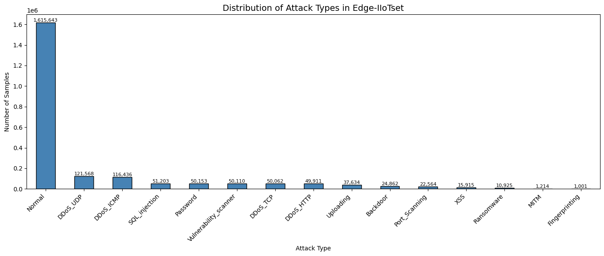

### Model performance on clean data
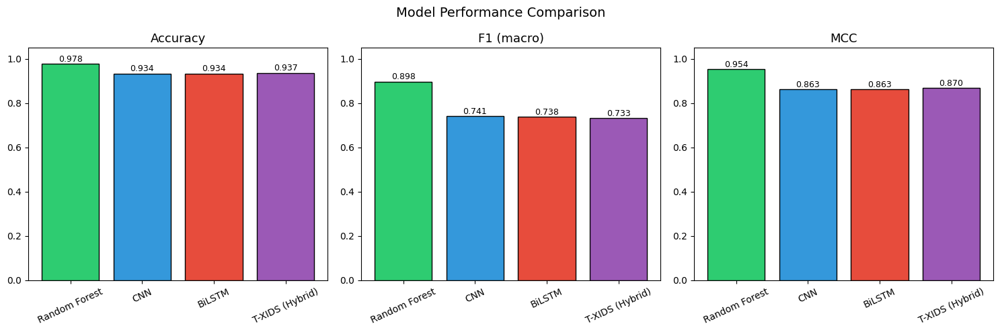

### Training history
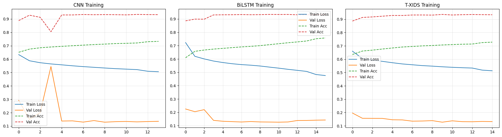

### Hybrid model confusion matrix
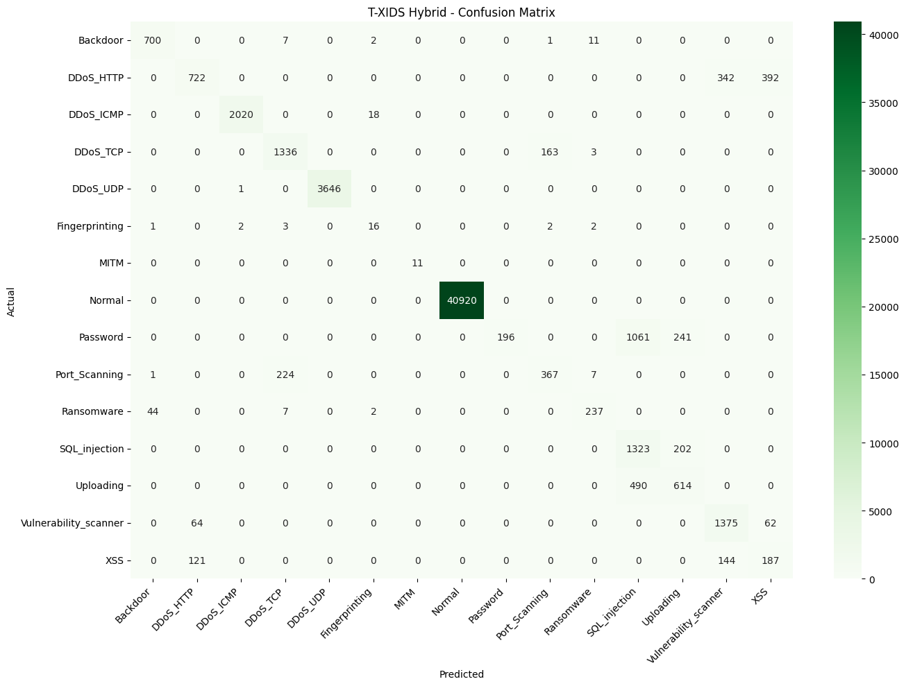

### Random Forest confusion matrix
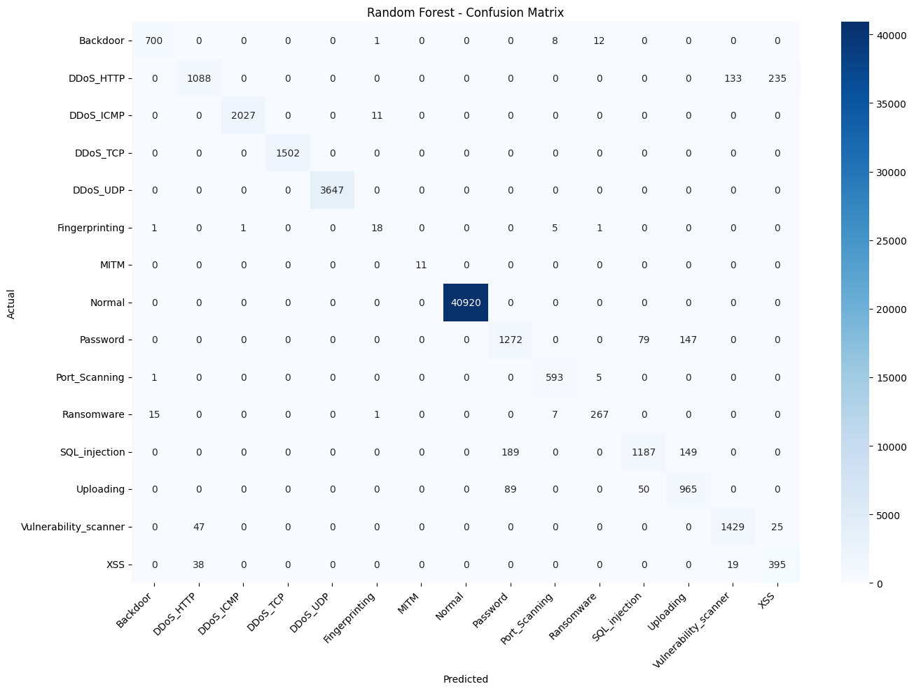

### ROC curves — all 15 classes
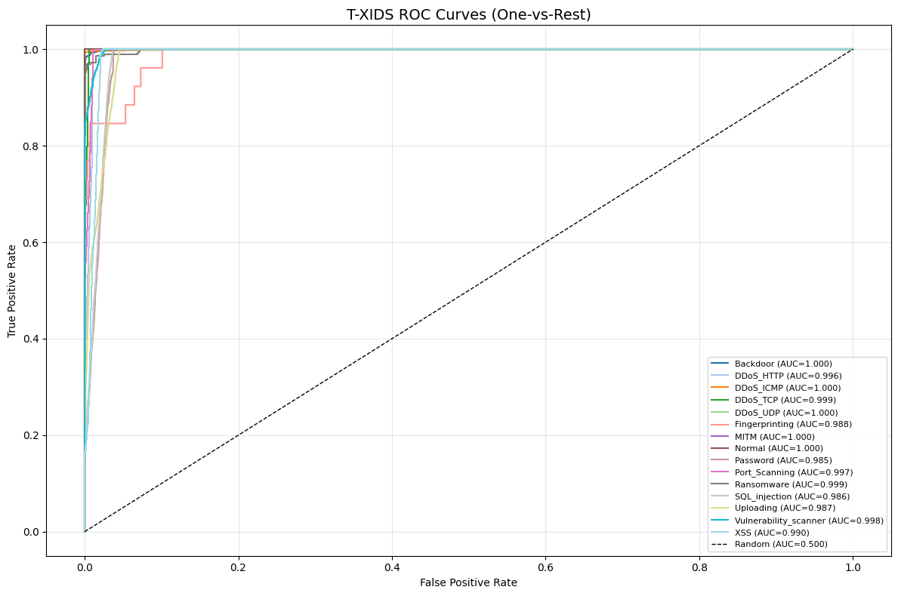

### Adversarial robustness — all models
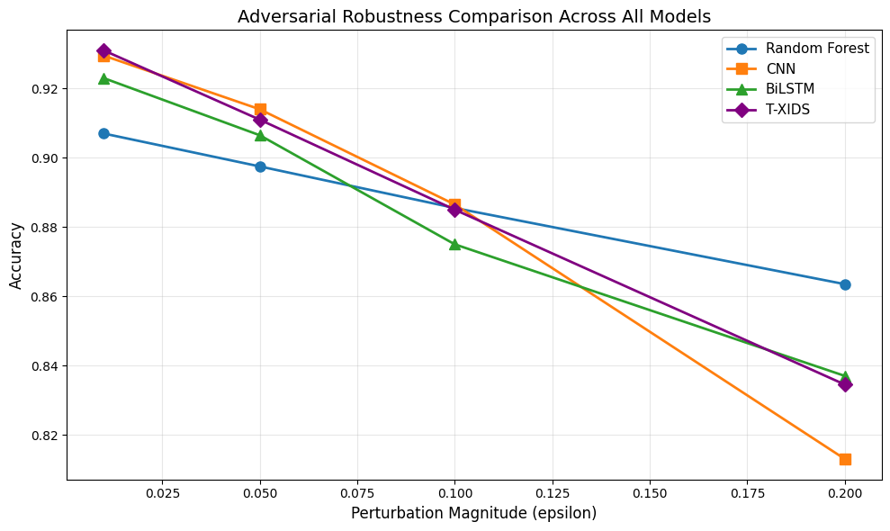

### Adversarial accuracy degradation — hybrid model
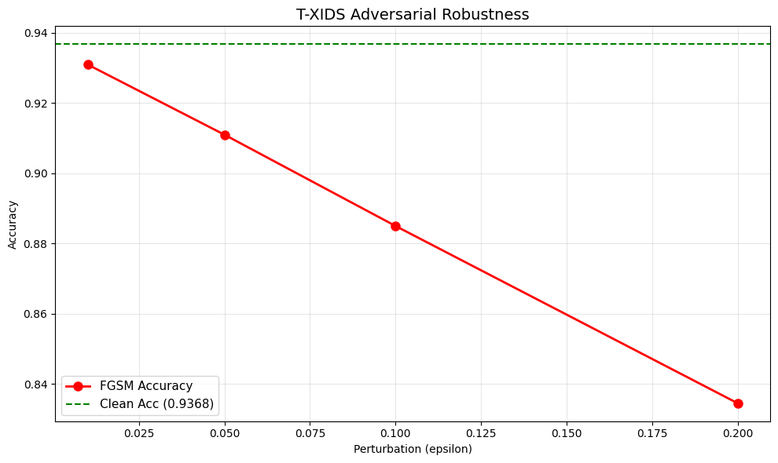

### SHAP feature attribution
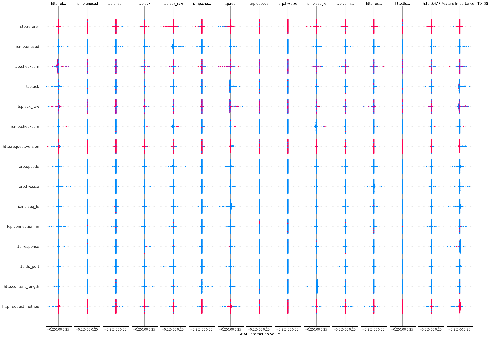

### SHAP autoencoder reconstruction error distribution
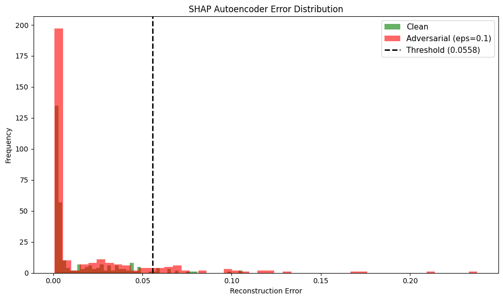

### SHAP fingerprinting detection across epsilon levels
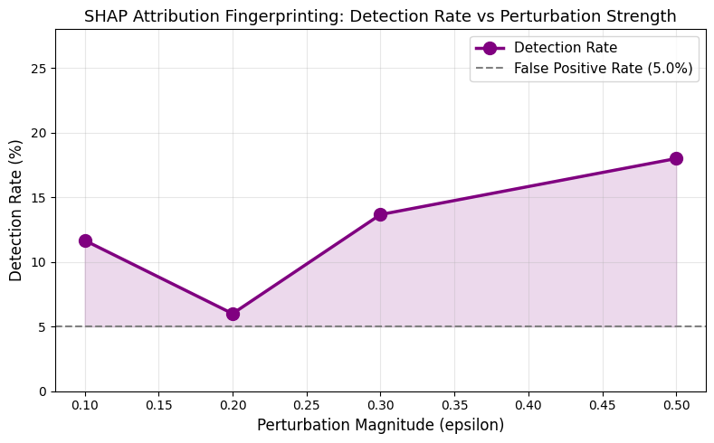

---

## Stack

See `docs/stack.md` for the full environment and library breakdown.

---

## Repo structure

```
adversarial-iot-ids/
├── README.md
├── .gitignore
├── notebook/
│   └── ids_experiment.ipynb        # Full experiment
├── results/
│   └── figures/                    # All charts and visualisations
└── docs/
    ├── dataset.md                  # Dataset source, preprocessing decisions
    └── stack.md                    # Environment and dependencies
```

---

## Reference

Ferrag, M.A. et al. (2022) 'Edge-IIoTset: A New Comprehensive Realistic Cyber Security Dataset of IoT and IIoT Applications', *IEEE Access*, 10, pp. 40281–40306.
